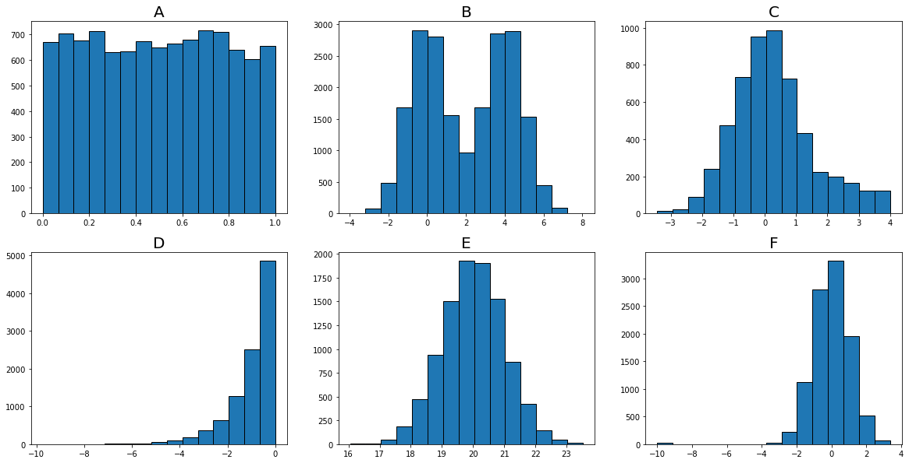

# Statistical Distributions

## Question 1

**Use the following information to determine your answers for questions 1 and 2:**

> The typicle adult male shoe size has a bell shaped distribution with a mean of 10.5 and a standard deviation of 1.3.

About 68% of adult men typically have a shoe size between a minimum of  ________ and a maximum of _____________

Please assign your answer to the variable `question_1`, with a datatype of `tuple`, rounded to the first decimal place, and with the following format:

`(min_value, max_value)`


```python
question_1 = (10.5 - 1.3, 10.5 + 1.3)
question_1
```


    (9.2, 11.8)


## Question 2

Suppose Johnny has a shoe size of 8. How many standard deviations are they from the mean? Please round to the second decimal point. Assign your answer to the variable `question_2`


```python
question_2 = round((10.5 - 8)/1.3, 2)
question_2
```


    1.92


## Question 3

**For the next three questions, use the following information to determine your answers:** 

A psychology experiment on memory was conducted which required participants to recall anywhere from 1 to 10 pieces of information. Based on many results, the (partial) probability distribution below was determined for the discrete random variable (X = number of pieces of information remembered (during a fixed time period)).

What is the missing probability `P(X=7)`? Your answer should be rounded to the second decimal, and assigned to the variable `question_3`.

| X = # of information 	| 1   	| 2    	| 3    	| 4    	| 5    	| 6    	| 7 	| 8    	| 9    	| 10   	|
|----------------------	|-----	|------	|------	|------	|------	|------	|---	|------	|------	|------	|
| Probability          	| 0.0 	| 0.02 	| 0.04 	| 0.07 	| 0.15 	| 0.18 	| ? 	| 0.14 	| 0.11 	| 0.05 	|


```python
# Your answer here
question_3 = round(1 - (0.02 + 0.04 + 0.07 + 0.15 + 0.18 + 0.14 + 0.11 + 0.05), 2)
question_3
```


    0.24


## Question 4
Using probabilities from the above table, complete the table below to provide the cumulative distribution function of X.

Please assign your answer to the variable `question_four` and format your response in the following way:

(val_one, val_two, val_three, val_four, val_five, val_six, val_seven, val_eight, val_nine, val_ten)

Please round each number to the second decimal place.

| X = # of information 	| 1 	| 2 	| 3 	| 4 	| 5 	| 6 	| 7 	| 8 	| 9 	| 10 	|
|----------------------	|---	|---	|---	|---	|---	|---	|---	|---	|---	|----	|
| Probability          	| ? 	| ? 	| ? 	| ? 	| ? 	| ? 	| ? 	| ? 	| ? 	| ?  	|


```python
val_one = 0.0
val_two = val_one + 0.02
val_three = val_two + 0.04
val_four = val_three + 0.07
val_five = val_four + 0.15
val_six = val_five + 0.18
val_seven = val_six + 0.24
val_eight = val_seven + 0.14
val_nine = val_eight + 0.11
val_ten = val_nine + 0.05
question_four = (val_one, val_two, val_three, val_four, val_five, val_six, val_seven, val_eight, val_nine, val_ten)
question_four
```


    (0.0, 0.02, 0.06, 0.13, 0.28, 0.46, 0.7, 0.84, 0.95, 1.0)


## Question 5

Given that the person recalls at least 7 pieces of information, what is the probability that they recall all 10 pieces? Please round to the second decimal place, and assign your answer to the variable `question_5`.


```python
# P(10| least 7) = P(least 7|10) * P(10)/P(least 7)
# P(10|least 7) = (1 * 0.05)/(0.24 + 0.14 + 0.11 + 0.05)
(1 * 0.05)/(0.24 + 0.14 + 0.11 + 0.05)
```


    0.09259259259259259


## Question 6 - Confidence Intervals

The typical amount of sleep per night that adults get is normally distributed with a mean of 7.5 hours and a standard deviation of 1.5 hours. 

A random sample of 35 Flatiron Students has a mean of 8.3 hours of sleep with a standard deviation of 3 hours. 

In the cell below, calculate the sample's standard error and the z statistic for a 95% confidence interval. Assign your answer to the variable `question_6` with a datatype of tuple and formatted as follows:

`(standard_error, z_value)


```python
from scipy import stats

std = 3
n = 35
standard_error = std/(n**0.5)
z_value = stats.norm.ppf(.975)
question_6 = (standard_error, z_value)
question_6
```


    (0.50709255283711, 1.959963984540054)


## Question 7 - Confidence Intervals

What is the 95% confidence interval for the mean number of hours slept by our sample of Flatiron Students?


```python
mu = 8.3
margin_of_error = z_value * standard_error
conf = (mu - margin_of_error, mu + margin_of_error)
print('The 95% confidence interval is ', conf)
```

    The 95% confidence interval is  (7.306116859610791, 9.29388314038921)


## Question 8 - Select the matching distribution

Consider the following distributions


```python
# Run this cell unchanged
from visuals import multiple_choice
multiple_choice()
```





Please assign the visualization title letter to the prompt that best matches the data.

1. Normal, symmetrical, visual evidence of outliers.
    - F
1. Unimodel, skewed to the right, no apparent outliers.
    - C
1. Uniform, symmetrical, no apparent outliers.
    - A
1. Normal, symmetrical, no apparrent outliers.
    - E
1. Bimodal, symmetrical, no apparent outliers.
    - B
1. Exponential, skewed to the left.
    - D
